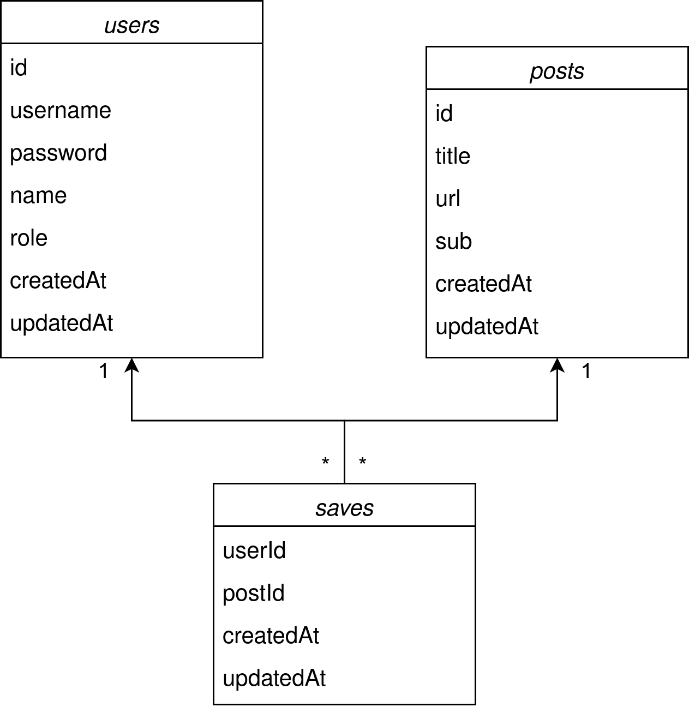
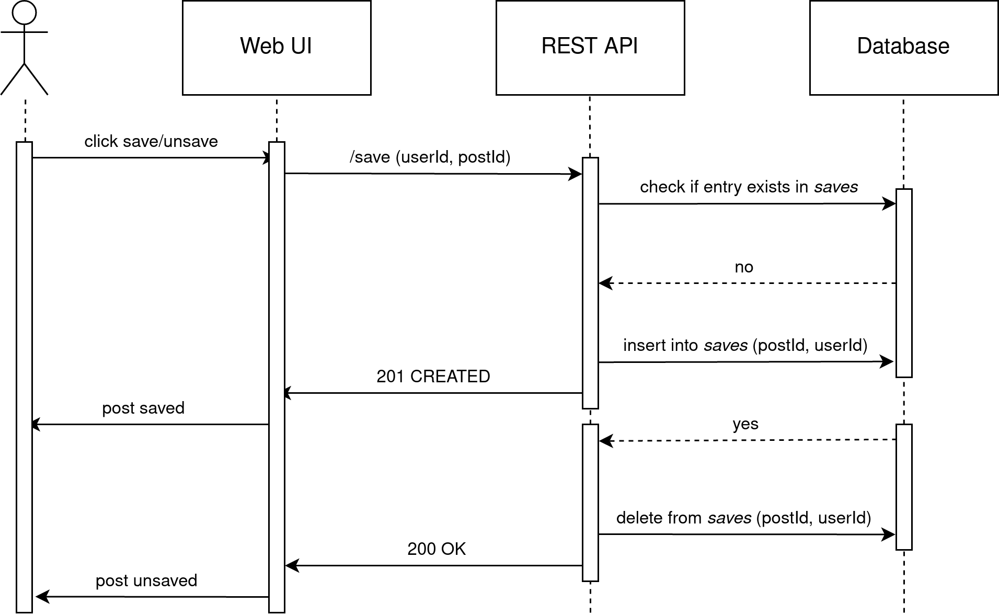

# softcon23-group48

**scrolller**: Browse and Save images from Reddit.

[Project Repository](https://github.com/Arish-Shah/softcon23-group48)

## Technology Stack

- **REST API**: Express.js
- **Web UI**: React.js
- **Database**: PostgreSQL

## Directory Structure

- `app/`: contains the application source code along with Dockerfiles for the REST API and Web UI.
- `helm/`: includes the umbrella helm chart `scrolller` and its three dependent sub-charts: `db`, `api`, and `web`.
- `k8s/`: contains the vanilla Kubernetes YAML files to deploy the application without using helm.
- `scripts/`: includes the shell scripts to build and publish the application docker images, and deploy through Kubernetes.

## Architecture

| Database Class Diagram                             | Save/Unsave Post Sequence Diagram                                  |
| -------------------------------------------------- | ------------------------------------------------------------------ |
|  |  |

## Requirements

You need to have `docker` and `microk8s` installed on your system. Enable the following addons for `microk8s` before installing the application:

```shell
microk8s enable dns cert-manager helm3 ingress metallb rbac registry storage
```

## Installation

1. Before installing the application, we build the images and publish them to the microk8s' private Docker registry.

```shell
docker build -t localhost:32000/api:v1 ./app/api
docker push localhost:32000/api:v1

docker build -t localhost:32000/web:v1 ./app/web
docker push localhost:32000/web:v1
```

2. Now, we install the application using Helm.

```shell
microk8s helm3 install scrolller ./helm -n scrolller --create-namespace
```

3. Add the following entry to the `/etc/hosts` file:

```
127.0.0.1 scrolller.vu api.scrolller.vu
```

4. Check the deployment status.

```shell
microk8s helm3 list -n scrolller

microk8s kubectl rollout status deployment/db-deployment -n scrolller
microk8s kubectl rollout status deployment/api-deployment -n scrolller
microk8s kubectl rollout status deployment/web-deployment -n scrolller
```

5. Navigate to the following URLs: https://scrolller.vu and https://api.scrolller.vu. After importing the SSL certificates for both Web UI and REST API, the application is accessible.

## Scaling

1. Inspect the current number of active pods.

```shell
microk8s kubectl get pods -n scrolller
```

2. Increase the `minReplicas` count for both the `api` and `web` sub-charts and upgrade the deployment.

```shell
microk8s helm3 upgrade scrolller ./helm -n scrolller
```

3. We can verify that no new revision was done to the application.

```shell
microk8s kubectl rollout history deployment/api-deployment -n scrolller
microk8s kubectl rollout history deployment/web-deployment -n scrolller
```

## Upgrade

#### Upgrade with deployment rollout

1. Update the footer tag's value in `app/web/src/layouts/root-layout.tsx`.

```
41    v2 / software containerization / group 48
```

2. Build and publish a new Docker image for the application with tag v2.

```shell
docker build -t localhost:32000/web:v2 ./app/web
docker push localhost:32000/web:v2
```

3. Now update the file `helm/charts/web/values.yaml` with the new version of the image.

```
6   image: localhost:32000/web:v2
```

4. Upgrade the helm deployment.

```shell
microk8s helm3 upgrade scrolller ./helm -n scrolller
```

5. Verify that this new deployment was rolled out.

```shell
microk8s kubectl rollout history deployment/web-deployment -n scrolller
```

#### Upgrade with canary update

1. To perform an upgrade using canary deployment, update the footer tag's value again in `app/web/src/layouts/root-layout.tsx`.

```
41    v3 / software containerization / group 48
```

2. Build and publish a new Docker image for the application with tag v3.

```shell
docker build -t localhost:32000/web:v3 ./app/web
docker push localhost:32000/web:v3
```

3. Enable the canary deployment value in `helm/charts/web/values.yaml`.

```
30   canary:
31      enabled: true
```

4. Upgrade the helm deployment.

```shell
microk8s helm3 upgrade scrolller ./helm -n scrolller
```

5. Check the currently running pods and services.

```
microk8s kubectl get pods --show-labels -n scrolller

microk8s kubectl get services -n scrolller
```

6. We can now complete the update of the application by rolling out this version.

```
microk8s kubectl scale --replicas=4 deploy web-v3-deployment -n scrolller
```

7. Delete the previous version of the deployment.

```
microk8s kubectl delete deployment web-deployment -n scrolller
```

## Uninstallation

We can uninstall the application as such.

```
microk8s helm3 uninstall scrolller -n scrolller
```
